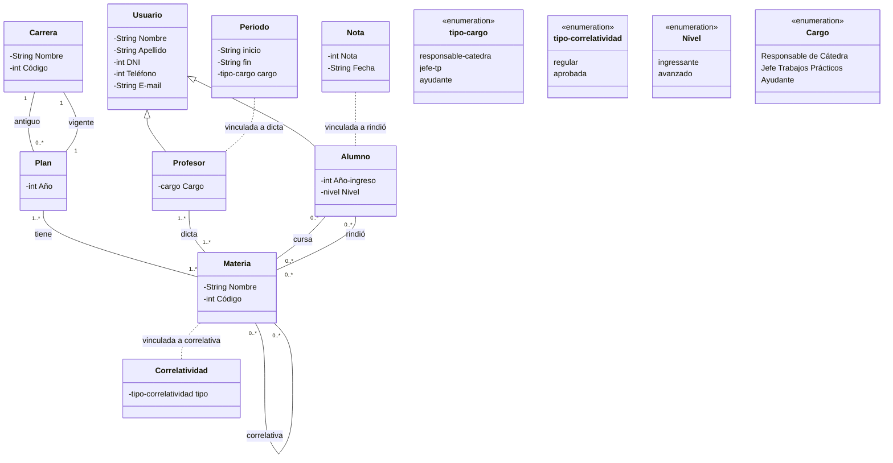

```mermaid
classDiagram
    class Usuario {
	    -String Nombre
	    -String Apellido
	    -int DNI
	    -int Teléfono
        -String E-mail
    }

    class Alumno {
	    -int Año-ingreso
	    -nivel Nivel
    }

    class Profesor {
        -cargo Cargo
    }

    class Materia {
	    -String Nombre
	    -int Código
    }

    class Periodo {
	    -String inicio
	    -String fin
	    -tipo-cargo cargo
    }

    class Correlatividad {
	    -tipo-correlatividad tipo
    }

    class Nota {
	    -int Nota
	    -String Fecha
    }

    class Carrera {
	    -String Nombre
	    -int Código
    }

    class Plan {
	    -int Año
    }

    class `tipo-cargo` {
	    responsable-catedra
	    jefe-tp
	    ayudante
    }

    class `tipo-correlatividad` {
	    regular
	    aprobada
    }

    class Nivel {
	    ingressante
	    avanzado
    }

    class Cargo{
        Responsable de Cátedra
        Jefe Trabajos Prácticos
        Ayudante
    }

	<<enumeration>> `tipo-cargo`
	<<enumeration>> `tipo-correlatividad`
	<<enumeration>> Nivel
    <<enumeration>> Cargo

    Carrera "1" -- "0..*" Plan : antiguo
    Carrera "1" -- "1" Plan : vigente
    Plan "1..*" -- "1..*" Materia : tiene
    Usuario <|-- Profesor
    Usuario <|-- Alumno
    Profesor "1..*" -- "1..*" Materia : dicta
    Periodo .. Profesor : vinculada a dicta
    Alumno "0..*" -- "0..*" Materia : cursa
    Alumno "0..*" -- "0..*" Materia : rindió
    Nota .. Alumno : vinculada a rindió
    Materia "0..*" -- "0..*" Materia : correlativa
    Materia .. Correlatividad : vinculada a correlativa
```
