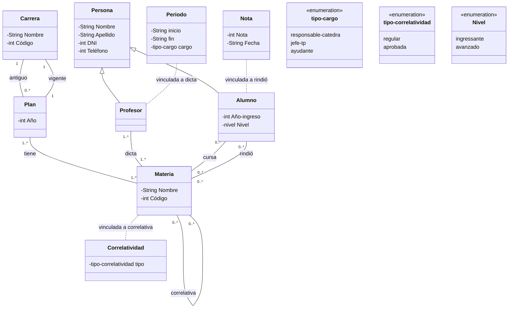

```mermaid
classDiagram
    class Persona{
        -String Nombre
        -String Apellido
        -int DNI
        -int Teléfono
    }
    class Alumno{
      -int Año-ingreso
      -nivel Nivel
    }
    class Profesor{
    }
    class Materia{
        -String Nombre
        -int Código
    }
    class Periodo{
        -String inicio
        -String fin
        -tipo-cargo cargo
    }
    class Correlatividad{
        -tipo-correlatividad tipo
    }
    class Nota{
        -int Nota
        -String Fecha
    }
    class Carrera{
        -String Nombre
        -int Código
    }
    class Plan{
        -int Año
    }

    Carrera "1" -- "0..*" Plan : antiguo
    Carrera "1" -- "1" Plan : vigente
    Plan "1..*" -- "1..*" Materia : tiene

    Persona <|-- Profesor
    Persona <|-- Alumno

    Profesor "1..*" -- "1..*" Materia : dicta
    Periodo .. Profesor : vinculada a dicta

    Alumno "0..*"-- "0..* " Materia : cursa
    Alumno "0..*" -- "0..*" Materia : rindió
    Nota .. Alumno : vinculada a rindió

    Materia "0..*" -- "0..*" Materia : correlativa
    Materia .. Correlatividad : vinculada a correlativa

    class tipo-cargo{
        <<enumeration>>
        responsable-catedra
        jefe-tp 
        ayudante
    }
    class tipo-correlatividad{
        <<enumeration>>
        regular
        aprobada
    }
    class Nivel{
        <<enumeration>>
        ingressante
        avanzado
    }
```
